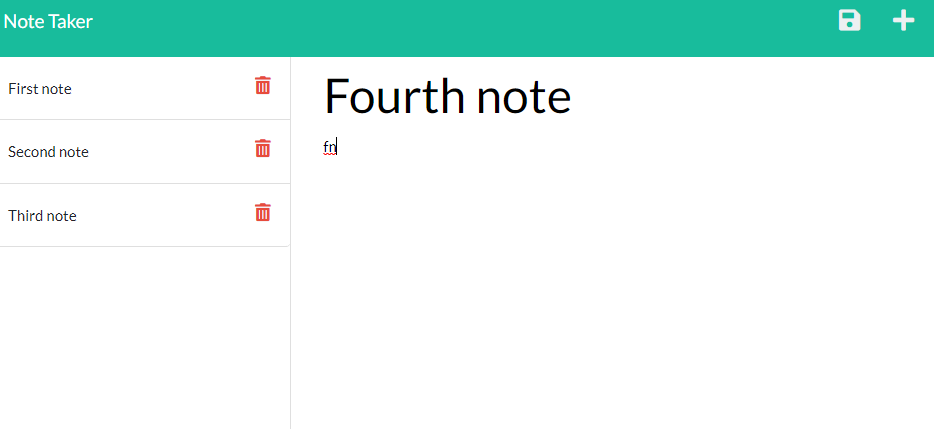
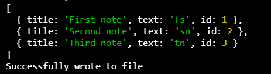

# Note-Taker

  ## Table of Contents

  * [Deployment](##deployment)
  * [User-Story](#user-story)
  * [Description](#description)
  * [Installation](#installation)
  * [Usage](#usage)
  * [Screen-Shots](#screen-shots)
  * [License](#license)
  * [Questions](#questions)

 
  

  ---

  ## Deployment
  Visit the application at: [https://note-taker-211414.herokuapp.com/](https://note-taker-211414.herokuapp.com/)
  ## User-Story
  AS A small business owner, I WANT to be able to write and save notes, SO THAT I can organize my thoughts and keep track of tasks I need to complete.

  ## Description
  An application that can be used to write and save notes using express.js and will save and retrieve note data from a JSON file

  ## Installation
  npm i express.js

  ## Usage
  To help a small buisness create a note taker application for easy use.

## Screen-Shots

    

  ## License 
  none
  

  ## Questions

  If any questions arise..

  Visit my Github at: [https://github.com/austinslatey](https://github.com/austinslatey)

  Reach out to me by email: austinslater58@gmail.com